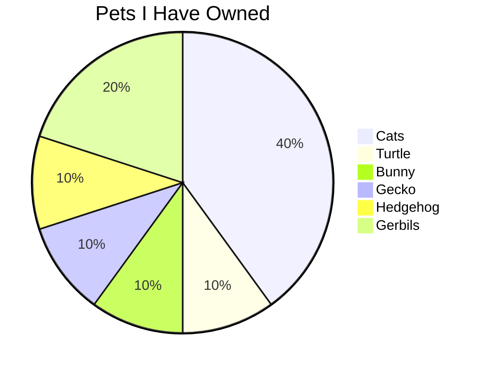

**CS PD Week GitHub Workshop Notes**

-this is a bullet
-this is another bullet

1. number
2. two

**Bold** and _italics_text.

Hello

You can also have 'inline code' formatting

on going project for students to work on
Git:
Clone - get full file 
Add - new files to track history
Commit - a new version and tell it to describe
Push - new history to another computer
Pull request - asking someone to add your branch to their main part
ACP loop

[Styling markdown tips](https://docs.github.com/en/get-started/writing-on-github/getting-started-with-writing-and-formatting-on-github/basic-writing-and-formatting-syntax)

Fizz Buzz game
Codewars, bebras challenge, leetcode, Advent of Code

-General Prompts: how many different ways can I think about solving this problem. Don't give me the answer.

Copilot is an AI model trained to understand software, might be outdated or close. 

Keiths practice for copilot: Add a script with tests that counts from 1 to 100 - it set it up in a fizzbuzz style, naming it fizzbutt

CoPilot prompt: Let's use the project README to describe and plan a new program to help with classroom seating charts. *use this prompt to let CoPilot think about the problem first, before writing the code. 

Then copilot gave options and suggestions to clarify.

Keith Prompt: single-page app that can be hosted in github pages- server backed app needs something else to run, then keith put inputs: classroom requirements student list drag and drop, ...then i got lost:)

Can create github projects and use their templates. Or, find a small project and change something minimal, to practice. 
